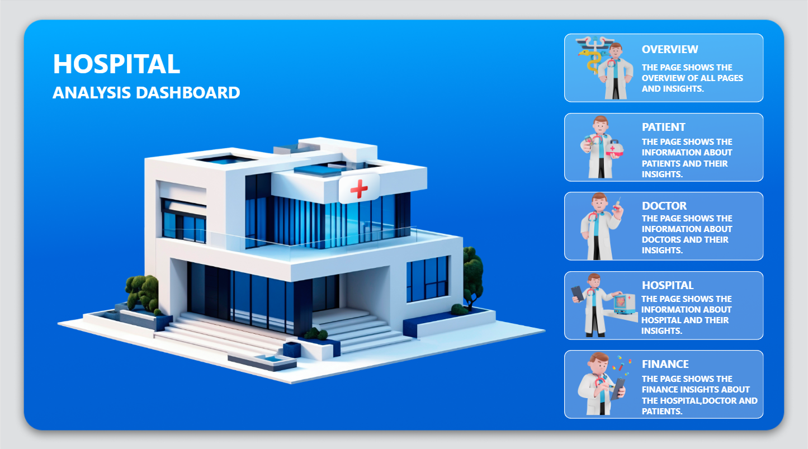
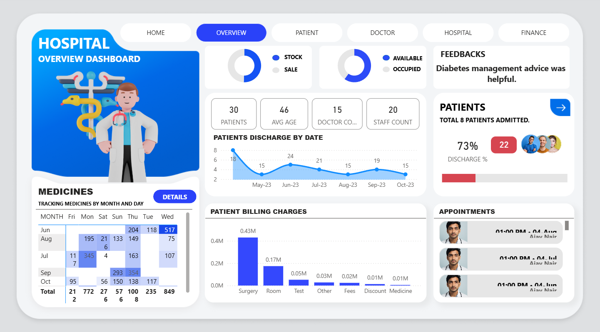
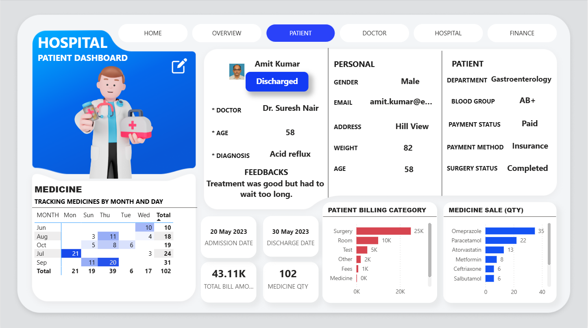
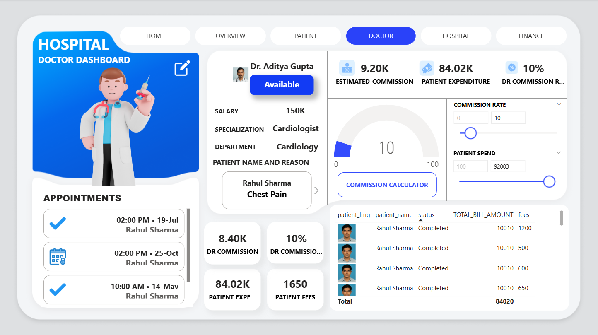
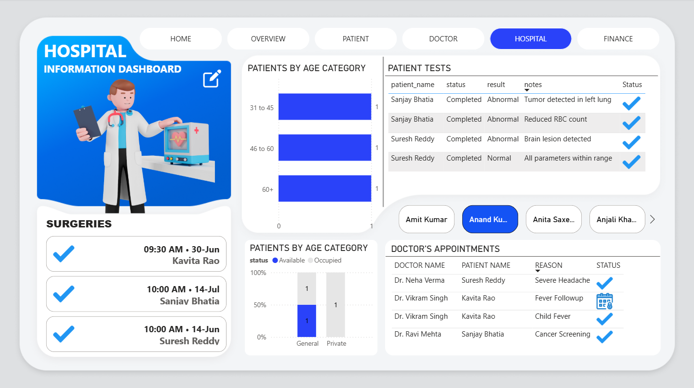
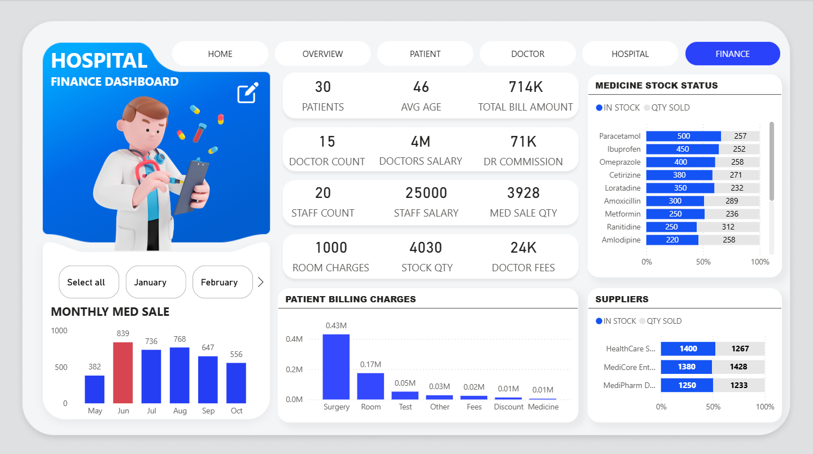
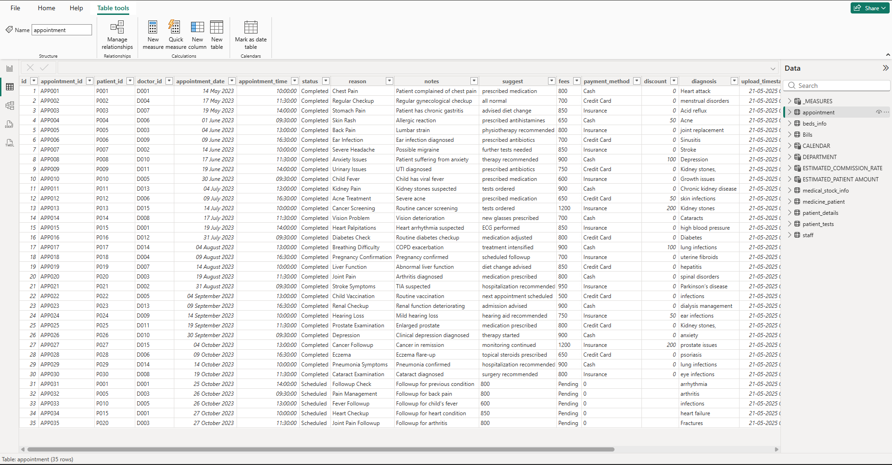
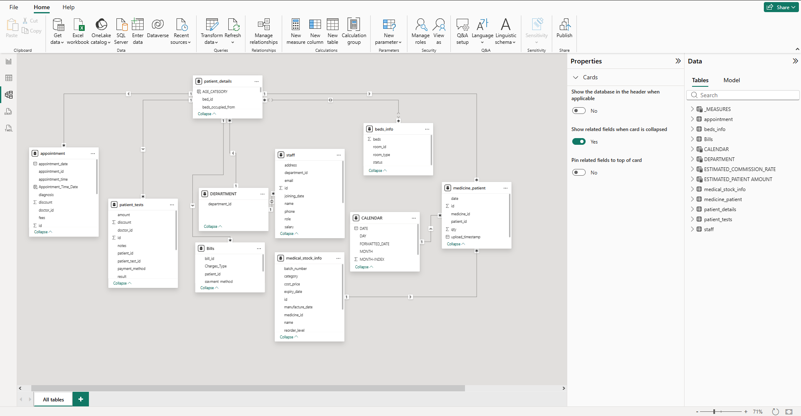

# 🏥 Hospital Analysis Dashboard — Power BI


> **A comprehensive multi-page hospital intelligence dashboard built in Power BI — covering patients, doctors, hospital operations, finance, medicines, and appointments in one unified system.**
> Designed for hospital administrators, finance teams, and medical staff to make data-driven decisions across all departments.

---

## 📸 Dashboard Preview

| Home Page | Overview Dashboard |
|---|---|
|  |  |

| Patient Dashboard | Doctor Dashboard |
|---|---|
|  |  |

| Hospital Information | Finance Dashboard |
|---|---|
|  |  |

| Appointment Table (Data Model) | Relational Data Model |
|---|---|
|  |  |

---

## 🚀 What Makes This Project Stand Out

This is not a single-page dashboard — it's a **full hospital management intelligence system** with 6 interconnected pages, each designed for a specific stakeholder. Built with a complex relational data model of 10+ tables.

- ✅ **6 dedicated dashboard pages** — Home, Overview, Patient, Doctor, Hospital, Finance
- ✅ **10+ relational tables** — appointments, patients, doctors, bills, medicines, staff, beds, tests, departments, calendar
- ✅ **Interactive navigation** — pill-style tab navigation across all pages
- ✅ **Commission Calculator** — interactive slider to calculate doctor commissions dynamically
- ✅ **Medicine stock tracking** — real-time stock vs sold quantity per medicine and supplier
- ✅ **Individual patient & doctor drill-through** — click any record to see full profile
- ✅ **Surgery & appointment scheduling** — status tracking with visual indicators

---

## 📊 Dashboard Pages

### 🏠 Page 1 — Home
- Visual landing page with 3D hospital illustration
- Navigation menu to all 5 dashboard sections:
  - **Overview** — Summary of all pages and insights
  - **Patient** — Patient information and insights
  - **Doctor** — Doctor information and insights
  - **Hospital** — Hospital operational insights
  - **Finance** — Finance insights across hospital, doctors, and patients

### 📋 Page 2 — Overview Dashboard
| Section | What It Shows |
|---------|--------------|
| **KPI Cards** | 30 Patients · 46 Avg Age · 15 Doctors · 20 Staff |
| **Medicine Calendar** | Medicine tracking by month and day (heat map matrix) |
| **Stock vs Sale Donut** | Medicine stock available vs sold ratio |
| **Bed Availability Donut** | Available vs occupied beds ratio |
| **Patient Discharge by Date** | Line chart — monthly discharge trend (May–Oct 2023) |
| **Patient Billing Charges** | Bar chart — Surgery (0.43M) → Room → Test → Other → Fees → Medicine |
| **Feedbacks** | Patient feedback text display |
| **Patients Panel** | 73% discharge rate, 22 active patients, profile photos |
| **Appointments** | Upcoming appointment list with doctor and time |

### 👤 Page 3 — Patient Dashboard
Full individual patient profile view with:
- **Patient selector** — drill into any patient record
- **Status badge** — Admitted / Discharged / Scheduled
- **Personal info** — Gender, Email, Address, Weight, Age
- **Medical info** — Department, Blood Group, Diagnosis, Assigned Doctor
- **Payment info** — Payment Status, Payment Method (Cash/Insurance/Credit Card), Surgery Status
- **Admission & Discharge dates**
- **Total Bill Amount** — e.g., ₹43.11K
- **Medicine Qty consumed** — e.g., 102 units
- **Patient Billing Category** — horizontal bar chart (Surgery, Room, Test, Other, Fees, Medicine)
- **Medicine Sale (Qty)** — top medicines by quantity (Omeprazole 35, Paracetamol 22, etc.)
- **Medicine Calendar** — heat map of medicine consumption by month and day

### 👨‍⚕️ Page 4 — Doctor Dashboard
Full individual doctor profile with:
- **Doctor selector** — drill into any doctor record
- **Availability status badge** — Available / On Leave
- **Specialization & Department** — e.g., Cardiologist, Cardiology
- **Salary** — e.g., 150K
- **Patient Name and Reason** — scrollable card showing current patient cases
- **Appointments list** — with date, time, patient name, status icons
- **KPI Cards** — DR Commission · DR Commission % · Patient Expenditure · Patient Fees
- **Commission Calculator** — interactive sliders:
  - Commission Rate slider (0–100%)
  - Patient Spend input
  - Estimated commission calculated dynamically
- **Gauge chart** — visual commission rate indicator (0–100)
- **Patient billing table** — patient name, status, total bill amount, fees

### 🏨 Page 5 — Hospital Information Dashboard
- **Surgery schedule** — upcoming surgeries with patient name, date, time, status
- **Patients by Age Category** — horizontal bar chart (31–45, 46–60, 60+)
- **Bed availability by ward type** — stacked bar (General vs Private, Available vs Occupied)
- **Patient Tests table** — patient name, status, result (Normal/Abnormal), notes with diagnosis
- **Patient selector** — filter all visuals by individual patient
- **Doctor's Appointments table** — Doctor Name, Patient Name, Reason, Status

### 💰 Page 6 — Finance Dashboard
- **Top KPI Row** — 30 Patients · 46 Avg Age · 714K Total Bill Amount
- **Second KPI Row** — 15 Doctors · 4M Doctors Salary · 71K DR Commission
- **Third KPI Row** — 20 Staff · 25,000 Staff Salary · 3,928 Med Sale Qty
- **Fourth KPI Row** — 1,000 Room Charges · 4,030 Stock Qty · 24K Doctor Fees
- **Month selector** — filter by month (Jan, Feb, etc.)
- **Monthly Medicine Sale** — bar chart by month (May: 382 → Jun: 839 → peak)
- **Patient Billing Charges** — bar chart by category (Surgery 0.43M highest)
- **Medicine Stock Status** — horizontal bar (In Stock vs Qty Sold per medicine)
  - Paracetamol: 500 stock / 257 sold
  - Ibuprofen: 450 / 252
  - Omeprazole: 400 / 258 ... and more
- **Suppliers panel** — HealthCare S., MediCore Ent., MediPharm D. — stock vs sold

---

## 🗃️ Data Model (10+ Tables)

```
┌─────────────────┐     ┌──────────────┐     ┌──────────────┐
│ patient_details │────▶│  appointment │────▶│ patient_tests│
└─────────────────┘     └──────────────┘     └──────────────┘
         │                      │
         ▼                      ▼
┌─────────────┐        ┌──────────────┐     ┌──────────────┐
│  beds_info  │        │    Bills     │     │   CALENDAR   │
└─────────────┘        └──────────────┘     └──────────────┘
         │
         ▼
┌─────────────┐        ┌──────────────┐     ┌──────────────┐
│ DEPARTMENT  │        │    staff     │     │medicine_stock│
└─────────────┘        └──────────────┘     └──────────────┘
                                │
                                ▼
                       ┌──────────────────┐
                       │ medicine_patient  │
                       └──────────────────┘
```

| Table | Key Columns | Purpose |
|-------|------------|---------|
| `patient_details` | patient_id, AGE_CATEGORY, bed_id | Core patient info, age group, bed assignment |
| `appointment` | appointment_id, patient_id, doctor_id, date, time, status, reason, fees, diagnosis | All appointments with status and billing |
| `patient_tests` | patient_test_id, patient_id, doctor_id, result, notes | Lab test results and notes |
| `Bills` | bill_id, patient_id, Charges_Type, payment_method | Billing breakdown by category |
| `beds_info` | beds, room_id, room_type, status | Bed and room availability tracking |
| `DEPARTMENT` | department_id | Hospital department structure |
| `staff` | id, name, role, salary, department_id | Staff and doctor records |
| `medical_stock_info` | medicine_id, name, category, cost_price, batch, reorder_level | Medicine inventory |
| `medicine_patient` | patient_id, medicine_id, qty, date | Medicine consumption per patient |
| `CALENDAR` | DATE, DAY, MONTH, FORMATTED_DATE, MONTH-INDEX | Date dimension table for time intelligence |
| `_MEASURES` | — | All DAX measures stored separately |
| `ESTIMATED_COMMISSION_RATE` | — | Doctor commission calculation table |
| `ESTIMATED_PATIENT_AMOUNT` | — | Patient expenditure estimates |

---

## ⚙️ Technical Implementation

### 🧮 Key DAX Measures

```dax
-- Total Patients
Total Patients = COUNTROWS(patient_details)

-- Average Patient Age
Avg Age = AVERAGE(patient_details[age])

-- Total Bill Amount
Total Bill Amount = SUM(Bills[amount])

-- Doctor Commission
DR Commission = SUMX(appointment, appointment[fees] * RELATED(ESTIMATED_COMMISSION_RATE[rate]))

-- Discharge Percentage
Discharge % = 
DIVIDE(
    COUNTROWS(FILTER(appointment, appointment[status] = "Completed")),
    COUNTROWS(appointment)
) * 100

-- Medicine Sale Quantity
Med Sale Qty = SUM(medicine_patient[qty])

-- Stock Remaining
Stock Remaining = SUM(medical_stock_info[qty]) - SUM(medicine_patient[qty])

-- Commission Calculator (Dynamic)
Estimated Commission = 
[Patient Spend Parameter] * [Commission Rate Parameter] / 100

-- Patient Billing by Category
Billing by Category = 
CALCULATE(SUM(Bills[amount]), ALLEXCEPT(Bills, Bills[Charges_Type]))
```

### 🎨 Design & Theme
- **Clean white/light grey background** with blue accent (#0A5BD1)
- **3D medical illustrations** for each dashboard section (doctor, patient, hospital, finance characters)
- **Pill-style navigation tabs** across the top — HOME, OVERVIEW, PATIENT, DOCTOR, HOSPITAL, FINANCE
- **Blue gradient** on the home page and left panel of each page
- **Status badges** — colour-coded (blue = Available/Completed, red = Admitted, green = Discharged)
- **Edit icon** on patient/doctor panels for drill-through navigation

### 📐 Interactive Features
- **Doctor Commission Calculator** — two sliders (Commission Rate + Patient Spend) with live gauge
- **Patient selector slicer** — pill buttons to switch between individual patients
- **Month filter** — horizontal scroll slicer for Finance page
- **Cross-page navigation** — all tabs navigate between pages using bookmarks/buttons
- **Appointment status icons** — checkmark (completed), calendar (scheduled)

---

## 🛠️ How to Use This Project

### Download & Explore
1. Download `HOSPITAL_ANALYTICS_DASHBOARD.pbix`
2. Open in **Power BI Desktop** (free from Microsoft)
3. Navigate between pages using the **tab buttons** at the top
4. Click any patient name or doctor name to drill into their individual profile
5. Use the **Commission Calculator sliders** on the Doctor page to simulate earnings

### Data Structure
The dashboard uses **sample hospital data** covering:
- **30 patients** across multiple departments
- **15 doctors** with specializations
- **20 staff members**
- **35 appointment records** (May–Oct 2023)
- **Medicine inventory** for 9+ medicines with stock and sale tracking
- **3 suppliers** — HealthCare S., MediCore Ent., MediPharm D.

---

## 📌 Skills Demonstrated

| Skill | Application |
|-------|-------------|
| **Complex Data Modelling** | 10+ table relational schema with multiple join types |
| **DAX** | Commission calculator, discharge %, billing aggregations, time intelligence |
| **Multi-Page Dashboard Design** | 6 pages with consistent navigation and theme |
| **Drill-Through Reports** | Individual patient and doctor profile pages |
| **Interactive Parameters** | Dynamic commission calculator with sliders |
| **Conditional Formatting** | Status badges, colour indicators, test result flags |
| **Calendar Table** | Custom date dimension for time-based analysis |
| **UX Design** | Pill navigation, 3D illustrations, clean card layouts |

---

## 🏥 Departments Covered

| Department | Example Doctor |
|------------|---------------|
| Cardiology | Dr. Aditya Gupta |
| Gastroenterology | Dr. Suresh Nair |
| Neurology | Dr. Neha Verma |
| General Medicine | Dr. Vikram Singh |
| Oncology | Dr. Ravi Mehta |

---

## 🔧 Requirements

| Tool | Notes |
|------|-------|
| Power BI Desktop | Free download from Microsoft |
| No API needed | Uses structured hospital sample data |

---

## 👨‍💻 Author

**Saketh Suman Bathini**
Data Analyst · AI Engineer · Full-Stack Developer · Hyderabad, India

[](https://www.linkedin.com/in/saketh-suman/)
[](https://github.com/SakethSumanBathini)
[](mailto:sakethsumanbathini@gmail.com)

---

## 📄 License

This project is open source and available under the [MIT License](LICENSE).

---

> ⭐ **If this project helped you, please give it a star!**
